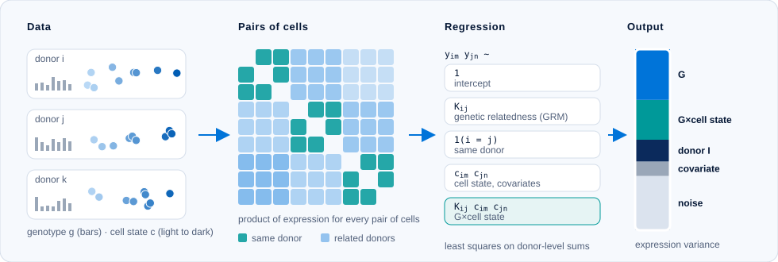

# scHINT

[](https://github.com/LidaWangPSU/scHINT/actions)

*Single-cell gene expression heritability with gene-by-cell-context interactions.*
Documentation: <https://LidaWangPSU.github.io/scHINT/>



```{r child = "vignettes/getting-started-body.inc"}
```
