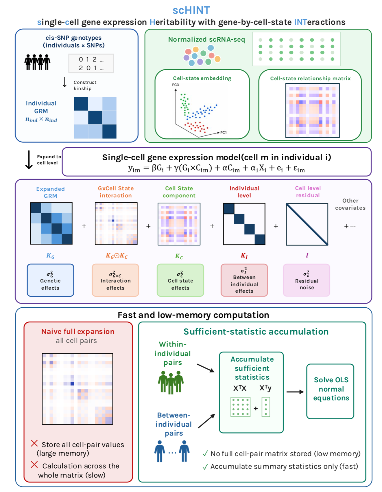

# scHINT

[](https://github.com/LidaWangPSU/scHINT/actions)

**s**ingle-**c**ell gene expression **H**eritability with gene-by-cell-context **INT**eractions.

scHINT estimates how much of a gene's expression variation is genetic, and how much of that
genetic effect depends on cell state or cell type, directly from single-cell data. It also
estimates perturbation × context variance in perturb-seq screens.



## Install

```r
# install.packages("remotes")
remotes::install_github("LidaWangPSU/scHINT")
```

## Documentation

**<https://LidaWangPSU.github.io/scHINT/>**: models, input and output formats, tutorials.

## Citation

Wang L, Fadil C, Wang L, Van Dyke K, Gusev A. *Single-cell gene expression heritability
informed by gene × cell-context interactions.* (manuscript)
