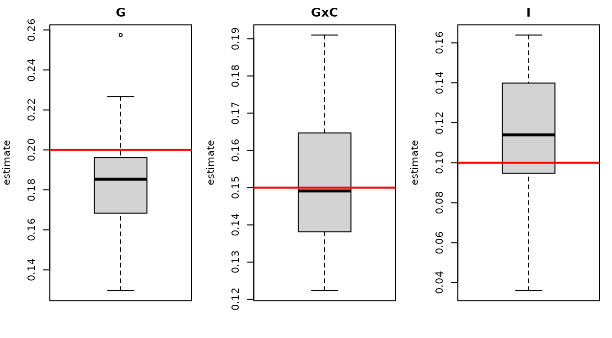

# Simulation and validation

This page shows how to simulate data with known variance components and
how to check that the estimators recover them. The simulators used for
the package example data are exported:
[`simulate_geno()`](https://LidaWangPSU.github.io/scHINT/reference/simulate_geno.md),
[`simulate_schint()`](https://LidaWangPSU.github.io/scHINT/reference/simulate_schint.md)
and
[`simulate_pert()`](https://LidaWangPSU.github.io/scHINT/reference/simulate_pert.md).

## Simulated architecture

For each gene, the cell-level generator draws

\\ y\_{im}=\sqrt{h_G^2}\\\tilde g_i+\sqrt{h^2\_{G\times C}}\\\tilde
g'\_i\\c\_{im} +\sqrt{h_I^2}\\e_i+\sqrt{h_o^2}\\\tilde
o\_{im}+\sqrt{h\_\varepsilon^2}\\\varepsilon\_{im}, \\

with \\\tilde g=Xb\\, \\\tilde g'=Xb'\\ polygenic scores from causal
SNPs (standardized to unit variance across donors), \\c\_{im}\\ a
standard-normal cell state and the remaining effects independent.
Variances sum to one.

## Bias and variance across replicates

``` r

geno <- simulate_geno(400, 250, seed = 11)
spec <- list(GENE = list(g = 0.20, gxc = 0.15, i = 0.10, cov = 0.05))
reps <- 30
est <- t(sapply(seq_len(reps), function(r) {
  s <- simulate_schint(geno, genes = spec, cells = c(20, 40), seed = 100 + r)
  f <- schint_cell(s$cell, "GENE", "donor", geno = geno, context = "state",
                   covariates = c("pc1", "pc2", "age", "sex", "batch", "subtype"))
  setNames(f$summary$variance[match(c("G", "GxC", "I"), f$summary$term)], c("G", "GxC", "I"))
}))
round(rbind(truth = c(G = .20, GxC = .15, I = .10), mean = colMeans(est), sd = apply(est, 2, sd)), 3)
#>           G   GxC     I
#> truth 0.200 0.150 0.100
#> mean  0.183 0.152 0.114
#> sd    0.026 0.017 0.029
```



The red line is the generating value. (The *realized* genetic variance
of a random polygenic score varies around its nominal value; in the cis
window the GRM captures only part of it, so estimates scatter around,
rather than exactly at, the nominal heritability.)

## Calibration of the jackknife

``` r

z <- t(sapply(seq_len(20), function(r) {
  s <- simulate_schint(geno, genes = list(GENE = list(g = 0.2, gxc = 0, i = 0.1, cov = 0.05)),
                       cells = c(20, 40), seed = 500 + r)
  f <- schint_cell(s$cell, "GENE", "donor", geno = geno, context = "state", jackknife = TRUE)
  f$coefficients[f$coefficients$component == "G:state", c("estimate", "se")]
}))
z <- data.frame(estimate = unlist(z[, 1]), se = unlist(z[, 2]))
c(mean_estimate = mean(z$estimate), sd_of_estimates = sd(z$estimate), mean_jackknife_se = mean(z$se))
#>     mean_estimate   sd_of_estimates mean_jackknife_se 
#>       0.000177742       0.002692167       0.003254096
```

With no G×state effect the average estimate is close to zero, and the
average jackknife SE is of the same size as the empirical standard
deviation of the estimates.

## Simulating your own scenarios

``` r

sim <- simulate_schint(
  geno,
  genes = list(MYGENE = list(g = 0.1, gxc = 0.1, i = 0.05, cov = 0.05)),  # rest is noise
  n_causal = 20, cells = c(30, 60), n_celltypes = 6, seed = 1
)
sim$cell      # cell-level data (one cell type)
sim$sample    # donor x cell-type pseudobulk
sim$truth     # generating variances
```

Use your own genotype matrix to retain real allele-frequency and LD
structure.
