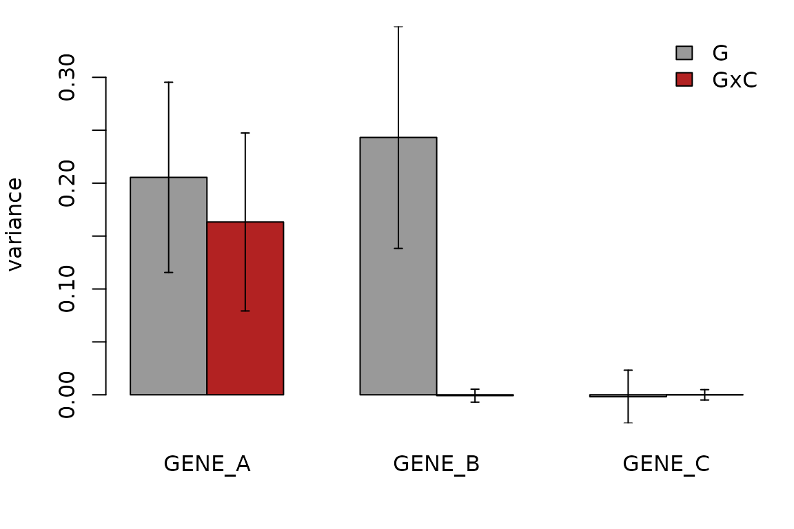

# Tutorial: G×Cell-State heritability

This tutorial fits the cell-level model to the simulated example.
`ex$cell` holds 12,000 cells of one cell type from 400 donors; a
continuous cell `state`, cell covariates (`pc1`, `pc2`), donor
covariates (`age`, `sex`, `batch`) and three genes with known
architecture (`ex$truth`):

``` r

ex$truth
#>     gene    g  gxc    i  cov noise
#> 1 GENE_A 0.20 0.15 0.10 0.05   0.5
#> 2 GENE_B 0.25 0.00 0.10 0.05   0.6
#> 3 GENE_C 0.00 0.00 0.15 0.05   0.8
```

- `GENE_A`: main genetic + G×Cell-State + donor effect
- `GENE_B`: main genetic + donor effect, no interaction
- `GENE_C`: no genetic effect

## 1. Fit the model

``` r

covs <- c("pc1", "pc2", "age", "sex", "batch")
fitA <- schint_cell(ex$cell, "GENE_A", "donor", geno = ex$geno,
                    context = "state", covariates = covs, jackknife = TRUE)
fitA
#> scHINT model: 12000 observations, 400 donors, 1 GRM
#> 
#> Variance components (variance on the standardized-expression scale):
#>             term variance     h2     se   se_h2
#>                G  0.20500 0.4140 0.0449 0.08650
#>              GxC  0.16300 0.3290 0.0420 0.05680
#>          G_total  0.36900 0.7430 0.0624 0.06580
#>                I  0.07670 0.1550 0.0348 0.07130
#>          context  0.00704 0.0142 0.0042 0.00793
#>        covariate  0.04360 0.0879 0.0131 0.02840
#>  total_explained  0.49600     NA 0.0605      NA
#> 
#> Standard errors: jackknife over 400 donor blocks
```

`G` is the genetic variance present in every cell, `GxC` the genetic
variance that varies with `state`, and `G_total` their sum. `h2` is the
population-level heritability (cell-level residual removed from the
denominator; see
[Model](https://LidaWangPSU.github.io/scHINT/articles/model.md), section
7).

## 2. Is there G×Cell-State heritability?

Compare the interaction estimate and its jackknife standard error across
genes:

``` r

res <- do.call(rbind, lapply(c("GENE_A", "GENE_B", "GENE_C"), function(g) {
  f <- schint_cell(ex$cell, g, "donor", geno = ex$geno, context = "state",
                   covariates = covs, jackknife = TRUE)
  s <- f$summary
  cbind(gene = g, s[s$term %in% c("G", "GxC"), c("term", "variance", "se")])
}))
res$z <- res$variance / res$se
res
#>     gene term      variance          se             z
#> 1 GENE_A    G  2.054834e-01 0.044935305  4.5728725294
#> 2 GENE_A  GxC  1.633264e-01 0.042040189  3.8850057331
#> 3 GENE_B    G  2.432125e-01 0.052432249  4.6386052352
#> 4 GENE_B  GxC -7.989363e-04 0.003062612 -0.2608676159
#> 5 GENE_C    G -1.763903e-03 0.012526265 -0.1408163986
#> 6 GENE_C  GxC  6.656247e-07 0.002449649  0.0002717224
```

`GxC` is clearly non-zero for `GENE_A` only.



## 3. Several context axes

`context` accepts several columns, each with its own main and G× term.
Here the categorical `subtype` is added as a second context (one pooled
“same subtype” component):

``` r

f2 <- schint_cell(ex$cell, "GENE_A", "donor", geno = ex$geno,
                  context = c("state", "subtype"), covariates = covs)
f2$summary
#>              term    variance          h2
#> 1               G  0.21440353  0.41957982
#> 2             GxC  0.14995344  0.29345337
#> 3         G_total  0.36435697  0.71303318
#> 4       GxC:state  0.16794075  0.32865386
#> 5     GxC:subtype -0.01798730 -0.03520049
#> 6               I  0.07673174  0.15016120
#> 7         context  0.02630677  0.05148138
#> 8       covariate  0.04360033  0.08532424
#> 9 total_explained  0.51099582          NA
```

The per-variable terms `GxC:state` and `GxC:subtype` split the
interaction. With `cat_mode = "per_level"` a categorical context gets a
separate genetic variance per level.

## 4. Main-effect-only covariates versus context

A variable in `context` gets a main effect *and* a G× interaction. A
variable in `covariates` gets a main effect only. To mirror a typical
analysis, put the leading state PCs (say 5) in `context` and further PCs
and technical variables in `covariates`.

## 5. Multiple GRMs

``` r

grms <- lapply(split_snps(ex$geno, 3, by = "maf"), make_grm)   # a list of GRMs
f3 <- schint_cell(ex$cell, "GENE_A", "donor", grm = grms,
                  context = "state", covariates = covs)
f3$summary[, c("term", "variance", "h2")]
#>               term    variance         h2
#> 1                G 0.204228343 0.41130861
#> 2                1 0.049905548 0.10050800
#> 3                2 0.057175714 0.11514985
#> 4                3 0.097147081 0.19565076
#> 5              GxC 0.163952322 0.33019414
#> 6              1:C 0.071357990 0.14371245
#> 7              2:C 0.044389316 0.08939850
#> 8              3:C 0.048205016 0.09708319
#> 9          G_total 0.368180665 0.74150275
#> 10               I 0.077732238 0.15654996
#> 11         context 0.007035167 0.01416858
#> 12       covariate 0.043585040 0.08777872
#> 13 total_explained 0.496533110         NA
```

Here the cis SNPs are split into three MAF bins (rarest first), each
with its own main and G×Cell-State variance; `G` and `GxC` are the sums
over GRMs. Pass a list of genotype matrices, or of GRMs, to split by any
annotation.

## 6. Pre-computed GRMs

``` r

K <- make_grm(ex$geno)
all.equal(coef(schint_cell(ex$cell, "GENE_A", "donor", grm = K, context = "state",
                           covariates = covs)),
          coef(fitA))
#> [1] TRUE
```

## 7. Jackknife options

`n_blocks` groups donors into blocks (faster for very large cohorts);
`seed` controls the assignment. The per-block estimates are in
`fit$jackknife$estimates`, from which the standard error of any function
of the components can be computed.

``` r

jk <- schint_cell(ex$cell, "GENE_A", "donor", geno = ex$geno, context = "state",
                  covariates = covs, jackknife = TRUE, n_blocks = 20)
B  <- jk$jackknife$estimates
ratio <- B[, "G:state"] / B[, "G"]                        # a custom statistic
sqrt((length(ratio) - 1) / length(ratio) * sum((ratio - mean(ratio))^2))
#> [1] 0.2639944
```
